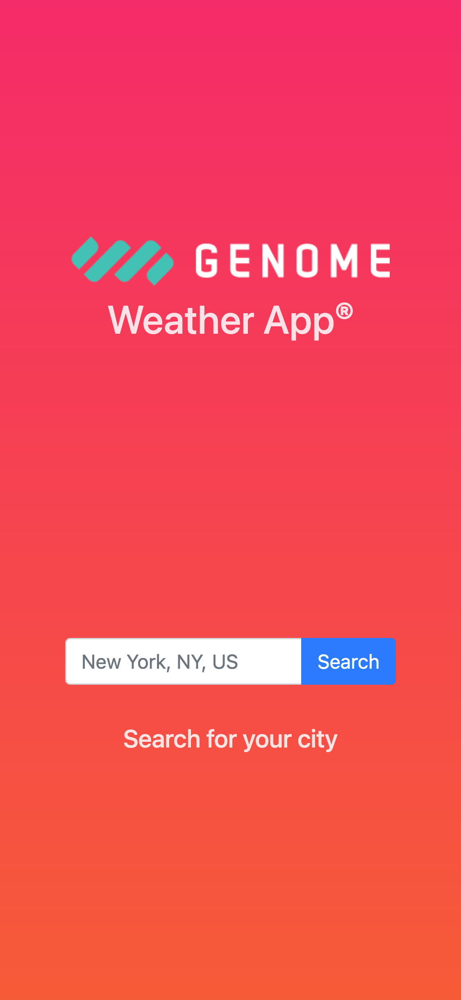
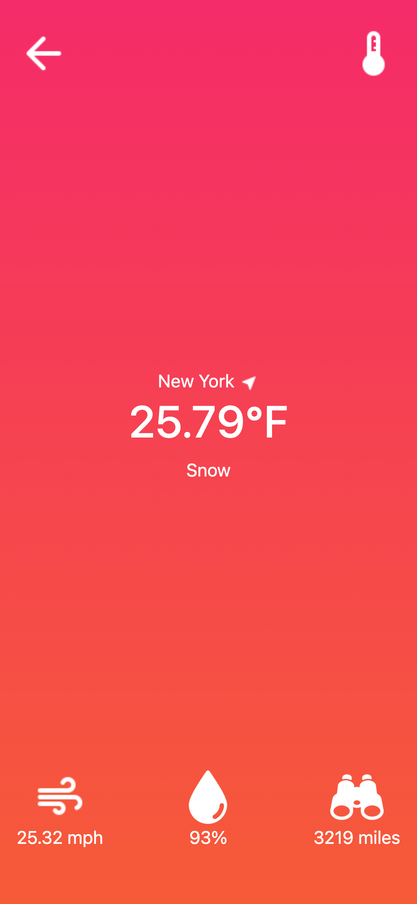

               

# Genome Code Challenge

> Weather App built for Genome as a code challenge.

  
  

This project consists of a mobile-first MVP of a weather application connected to the [Open Weather Map API](http://openweathermap.org/API).

## Built With

- Ruby on Rails
- HTML
- SCSS
- Bootstrap
- CircleCI
- Git
- GitHub
- GitHub actions
- Heroku
- Code Climate

## Live Demo

[Live Demo Link](https://genome-code-challenge.herokuapp.com/)

## Getting Started

To get a local copy up and running follow these simple example steps.

### Prerequisites

- [Ruby](https://genome-code-challenge.herokuapp.com/)
- [Bundler](https://bundler.io/)
- [Git](https://git-scm.com/) 

### Setup

1. Clone the project by using `git clone git@github.com:davidauza-engineer/genome-code-challenge.git`

### Install

1. Run `bundle` in the root directory of the project.
2. Run `yarn install --check-files` in the root directory of the project.

### Usage

1. Run `rails s` in the root directory of the project to run the project on `http://localhost:3000/`

### Run tests

1. Run `bundle exec rspec` in the root directory of the project.

### Deployment

The project is deployed in `Heroku` and it is based in the `master` branch.

## Author

👤 **David Auza**

- GitHub: [@davidauza-engineer](https://github.com/davidauza-engineer)
- Twitter: [@davidauzaeng](https://twitter.com/davidauzaeng)
- LinkedIn: [LinkedIn](https://www.linkedin.com/in/davidauza-engineer/)

## 🤝 Contributing

Contributions, issues, and feature requests are welcome!

Feel free to check the [issues page](https://github.com/davidauza-engineer/genome-code-challenge/issues) and the [project page](https://github.com/davidauza-engineer/genome-code-challenge/projects/1).

## Show your support

Give a ⭐️ if you like this project!

## Acknowledgments

- To the incredible maintainers of [Rails](https://rubyonrails.org/) and all the dependencies used in this project.
- To the [Genome](https://geno.me/) team for allowing me to build this project.
- To the team behind [Material Design](https://material.io/) for providing some of the cool icons used in this project.
- To [Good Ware](https://www.flaticon.com/authors/good-ware) for the really cool water drop icon.
- To [Gregor Cresnar](https://www.flaticon.com/authors/gregor-cresnar) for the really cool binoculars icon.
- To my beloved wife and son for the inspiration and support to do my favorite activity ever: Build software :technologist:

## 📝 License

This project is [MIT](./LICENSE) licensed.

## Future Features :computer:

1. Configure [Sentry](https://sentry.io/)
2. Configure [Brakeman](https://github.com/presidentbeef/brakeman)
3. Configure [Reek](https://github.com/troessner/reek)
4. Implement search auto-complete.
5. Implement a dropdown with a list of the main cities around the user.
6. Improved Desktop UI.
7. Add a tooltip explaining the proper input format in the search box.
